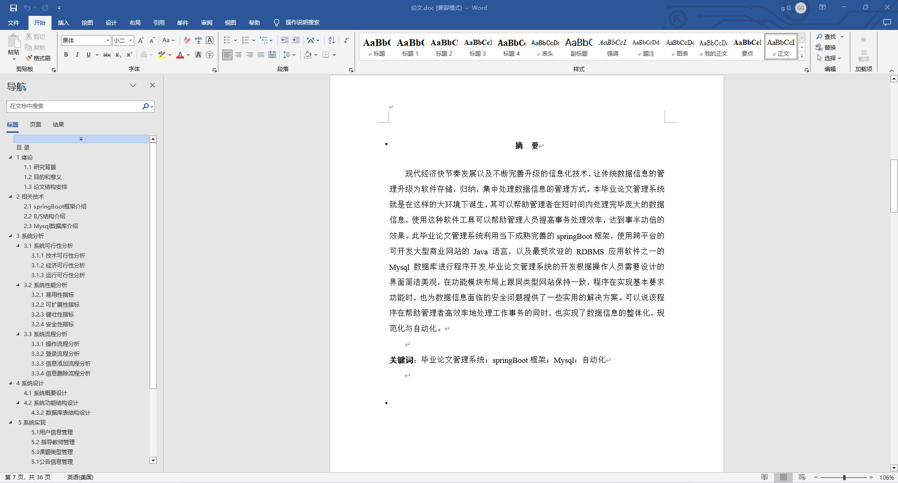
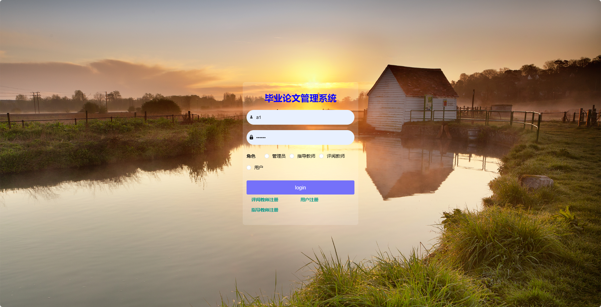
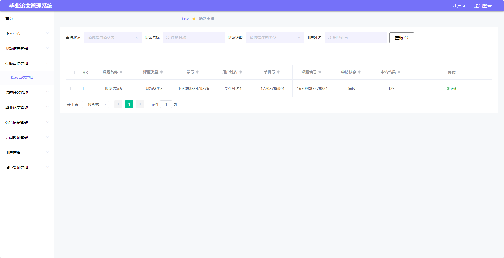
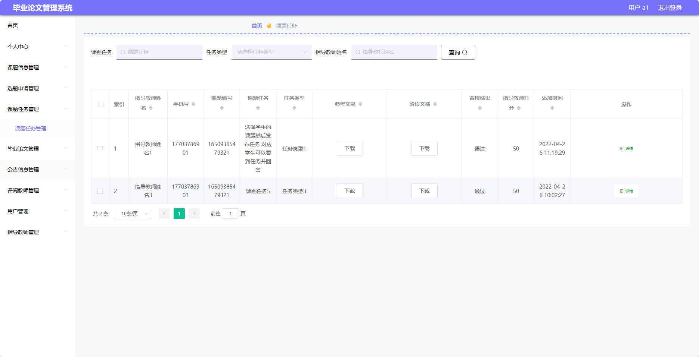
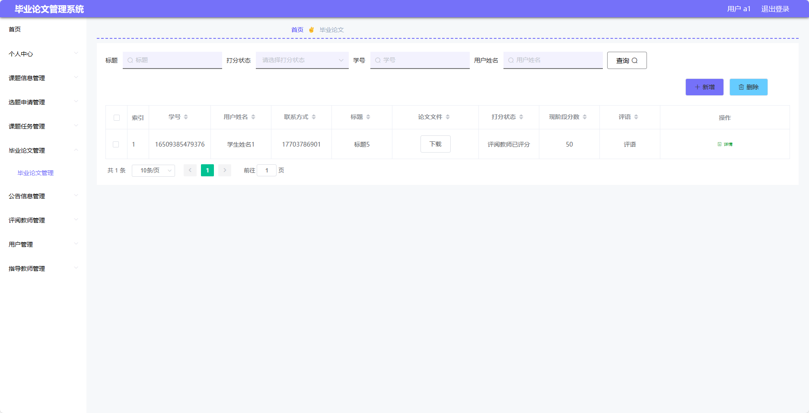
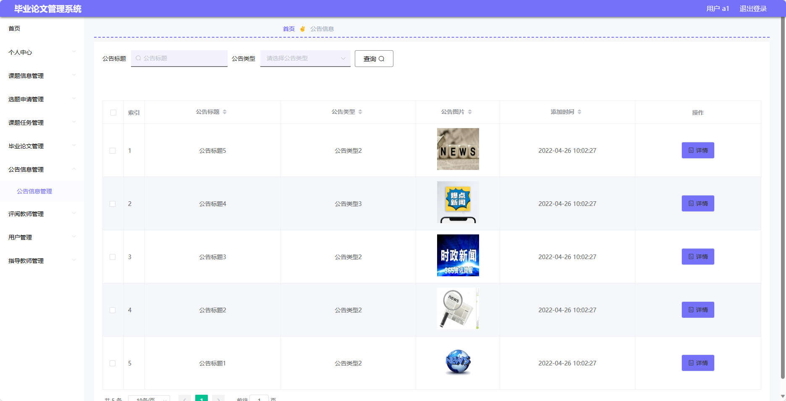
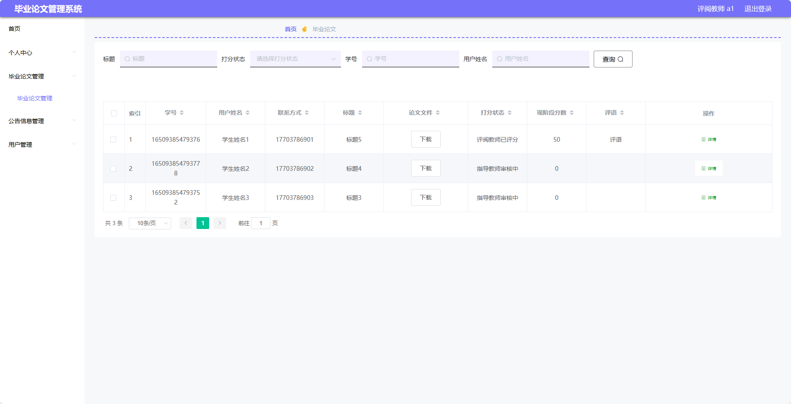
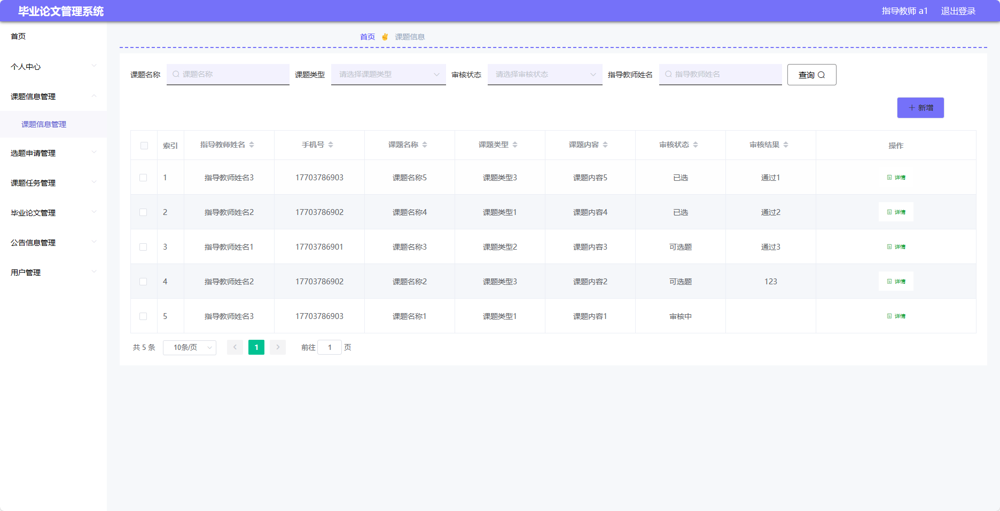
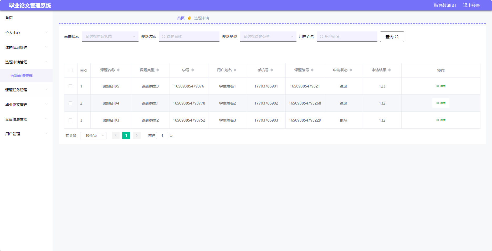
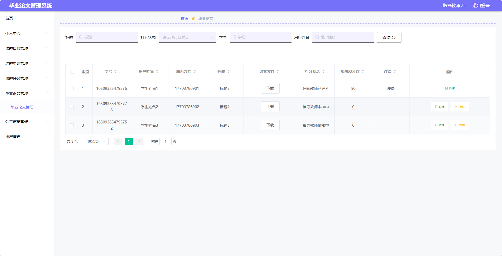

## 基于SpringBoot的毕业论文管理系统(程序+报告)

###  获取sql数据库文件: 从戎源码网 (https://armycodes.com/) QQ: 386869957 QQ群: 377586148
###  所有系统地址: (https://github.com/YuLin-Coder/AllProjectCatalog) 
###  所有项目以及源代码本人均调试运行无问题 可支持远程安装部署调试、定制修改、代码讲解

## 项目介绍
基于SpringBoot的毕业论文管理系统，系统包含四种角色：管理员、评阅教师、指导教师、用户,系统分为前台和后台两大模块，主要功能如下。

### 【管理员】:
- 个人中心：管理个人信息。
- 管理员管理：管理管理员的信息和权限。
- 毕业论文管理：查看、审核和管理所有学生上传的毕业论文。
- 课题信息管理：创建、修改和管理课题信息。
- 选题申请管理：审批和管理学生的选题申请。
- 课题任务管理：发布、修改和管理课题的任务进度。
- 基础数据管理：管理系统的基础数据。
- 公告信息管理：发布和管理公告信息。
- 评阅教师管理：管理评阅学生毕业论文的教师信息。
- 用户管理：管理用户的信息和权限。
- 指导教师管理：管理指导学生的教师信息。

### 【用户】:
- 个人中心：管理个人信息。
- 课题信息管理：查看和管理已选课题的信息。
- 选题申请管理：申请选择毕业论文的课题。
- 课题任务管理：查看和管理所选课题的任务进度。
- 毕业论文管理：上传、修改和查看自己的毕业论文。
- 公告信息管理：查看系统发布的公告信息。
- 评阅教师管理：查看和选择评阅自己毕业论文的教师。
- 用户管理：管理自己的账户信息。

### 评阅教师：
- 个人中心：管理个人信息。
- 毕业论文管理：查看和评阅指派给自己的毕业论文。
- 公告信息管理：发布和管理公告信息。
- 用户管理：管理用户的信息和权限。
- 指导老师管理：管理指导学生的教师信息。

### 指导教师：
- 个人中心：管理个人信息。
- 课题信息管理：创建、修改和管理课题信息。
- 选题申请管理：审批和管理学生的选题申请。
- 课题任务管理：发布、修改和管理课题的任务进度。
- 毕业论文管理：查看和评阅指导的学生的毕业论文。
- 公告信息管理：发布和管理公告信息。
- 用户管理：管理用户的信息和权限。

## 项目技术
- 编程语言：Java
- 数据库：MySQL
- 项目管理工具：Maven
- 前端技术：HTML、CSS、JavaScript、Jquery、Vue
- 后端技术：Spring、SpringMVC、MyBatis

## 运行环境
- JDK版本：JDK1.8及以上
- 开发工具：IDEA、Ecplise、Myecplise都可以
- 数据库: MySQL5.7及以上
- Maven：maven3.0及以上
- Node：14.14.0及以上

## 运行截图

